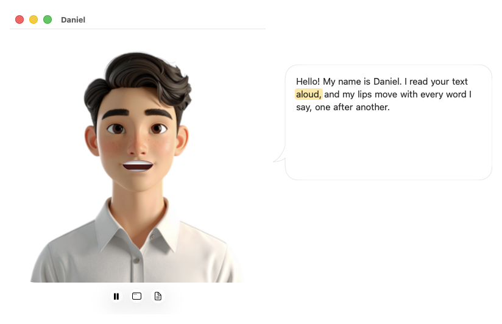
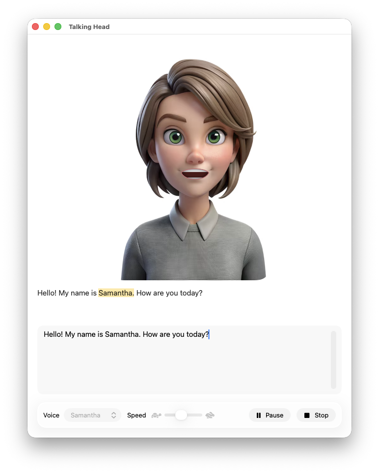

# Talking Head

A macOS menu bar applet and `th` command-line tool that reads text aloud with Apple's built-in speech
engine while an animated portrait lip-syncs to it.

- **Two characters:** a man (Daniel's voice) and a woman (Samantha's voice).
- **Lip sync:** the mouth follows the audio actually playing, using 12 cartoon mouth shapes derived from
  the spelling of each word. Loudness scales how far it opens.
- **Blinking:** the eyelids blink every few seconds.
- **Speech bubble:** a bubble beside the head shows the text, highlights the word being spoken, and
  scrolls to follow it. Click the head to show or hide it.
- **Controls:** play/pause, type text, or pick a file to speak, from buttons below the head or from the
  menu bar.
- **From other apps:** select text (an email in Mail, a paragraph in Safari…) and choose **Services →
  Speak with Talking Head**, or open a `talkinghead://` link. Web links are read too, and a link to a
  highlight (`#:~:text=…`) reads just the highlighted passage.

 

https://github.com/user-attachments/assets/fa5e0d48-b055-455c-b689-b5dfc53b3d40



https://github.com/user-attachments/assets/e3388cf4-3ee7-45cc-b270-c060d18efc0e

**Feature tour:** [`docs/index.html`](docs/index.html) is a page where every feature has a 🔊 **Explain**
link that makes Talking Head explain it out loud. It also shows how to add such links to your own pages.

## Requirements

- macOS 26 (Tahoe) or later
- Xcode 26 or later (Swift 6)
- [XcodeGen](https://github.com/yonaskolb/XcodeGen), only if you change `project.yml`
  (`brew install xcodegen`)

## Build

```sh
xcodebuild -project TalkingHead.xcodeproj -scheme TalkingHead -configuration Debug \
  -derivedDataPath build build
```

The app is built to `build/Build/Products/Debug/TalkingHead.app`. You can also open
`TalkingHead.xcodeproj` in Xcode and run it.

Run the unit tests (mouth-shape rules and `th` argument parsing):

```sh
xcodebuild -project TalkingHead.xcodeproj -scheme TalkingHead -derivedDataPath build test
```

`project.yml` is the source of truth for the Xcode project. After changing it, run
`xcodegen generate` and commit both files.

## Install

```sh
cp -R build/Build/Products/Debug/TalkingHead.app /Applications/
ln -sf /Applications/TalkingHead.app/Contents/MacOS/th /usr/local/bin/th
open /Applications/TalkingHead.app
```

To keep it in the menu bar all the time, turn on **Launch at Login** in its menu. On macOS Tahoe,
also check that it's allowed in System Settings → Menu Bar.

## Menu bar applet

Launched from Finder or at login, Talking Head runs only in the menu bar: no Dock icon and no app menu.
Its menu offers:

- **Show Talking Head** opens the face window.
- **Type Text to Speak…** opens a window with a text box and a Speak button (⌘⏎).
- **Play/Pause** and **Stop**.
- **Voice:** Male (Daniel) or Female (Samantha).
- **Speed:** Slower, Normal or Faster (applies from the next text spoken).
- **Always on Top:** keeps the talking head (and its bubble) above other windows. Remembered between
  launches.
- **Launch at Login.**
- **Quit.**

## Face window

- The title is the voice name.
- Click the head to show or hide the speech bubble. It starts hidden, and moves and resizes with the
  window.
- The toolbar below the head has four buttons:
  - play/pause (Space). When nothing is playing, it replays the last text.
  - **Type text to speak** opens the typing window.
  - **Select a file to speak** picks a text file (plain text, RTF, HTML, …).
  - **Pin/unpin** keeps the window above other windows (same as **Always on Top** in the menu).

## Command line: `th`

```
th [-v|--voice male|female] [-t|--tty] [-f|--file path] [-u|--url URL] [--always-on-top] [text ...]
```

| Invocation | Result |
|---|---|
| `th Build finished` | Speaks the arguments as text, then quits |
| `th -f notes.txt` | Speaks the file (plain text, RTF, HTML, Word…), then quits |
| `echo "Hello" \| th`, `th < notes.txt` | Speaks piped standard input, then quits |
| `th -t` | Reads text typed at the terminal (end with Control-D), speaks it, then quits |
| `th` at a terminal | Shows the talking head only; use its toolbar to type text or pick a file |
| `th -v female …` | Uses Samantha instead of Daniel (the default, `male`) |
| `th --always-on-top …` | Keeps the talking head above other windows for this run |
| `th -- -5 degrees` | `--` ends the options, so text can start with `-` |
| `th -u 'https://example.com/#:~:text=This%20domain'` | Speaks the web page, or just the passage its text fragment highlights |

`th` quits when you close its windows, so the terminal gets its prompt back. If you use the typing
window or file picker, it stays open after speaking. `th --help` prints usage. Errors print a message
and exit with status 2.

## Speaking from other apps

**Services menu.** Select text in any app (for an email in Mail, click in the message and press ⌘A), then
right-click → **Services → Speak with Talking Head** (also in the app menu → Services). If the
selection is a single web link, Talking Head reads that page instead. The face window opens and
starts speaking.

The app needs to be in `/Applications` (or launched once) for macOS to list the service. If it doesn't
appear, check System Settings → Keyboard → Keyboard Shortcuts → Services → Text, where you can also give
it a keyboard shortcut.

**Links.** `talkinghead://` URLs work from Shortcuts, scripts, notes, or a browser's address bar:

| URL | Result |
|---|---|
| `talkinghead://speak?text=Hello%20there` | Speaks the text |
| `talkinghead://speak?url=<percent-encoded URL>` | Speaks the page, or its highlighted passage |
| add `&voice=female` or `&voice=male` | Picks the voice (when nothing is playing) |

For example, from Terminal: `open "talkinghead://speak?text=Build%20finished&voice=female"`.

**Text fragments.** Links made with Safari's **Copy Link to Highlight** (and Chrome's **Copy link to
highlight**) end in `#:~:text=…`. Talking Head downloads the page, extracts its text, and finds the
passage using the text-fragment rules: `start`, `start,end`, and the optional `prefix-,` and `,-suffix`
context. Matching ignores case and differences in whitespace. Pages that build their text with
JavaScript may have little or no text to read.

## How it works

- **Speech:** `AVSpeechSynthesizer.write(_:toBufferCallback:)` renders the speech into audio buffers.
  The app plays them itself through `AVAudioEngine`, so it always knows which audio frame is audible.
  Pause and resume pause the player node, and the face freezes with it.
- **Timing:** while rendering, the app records a loudness envelope (RMS per 256 frames) and the frame
  at which each word starts. The synthesizer's word callbacks arrive in step with rendering.
- **Mouth shapes:** each word's spelling becomes a sequence of mouth shapes (visemes), such as
  "friend" → F, R, EE, N. The shapes share the time the word is actually voiced, vowels are held
  longer, and silence shows a resting mouth. The shape is parametric (width, lips, teeth, tongue,
  roundness), so it morphs smoothly between visemes.
- **Portraits:** each portrait is an image plus two textures generated from it: a mouthless skin patch
  that fades in when the mouth opens, and skin for the eyelids. The portrait's own smile shows when
  the mouth is closed.
- **`th`:** `th` is a shell script inside the app bundle (`Contents/MacOS/th`). It runs the app
  executable with the arguments packed into one `-THArguments` value, because AppKit would treat
  bare arguments such as file names as documents to open.

## Source layout

| Path | Purpose |
|---|---|
| `TalkingHead/TalkingHeadApp.swift` | App entry: menu bar item, windows, login item |
| `TalkingHead/LaunchOptions.swift` | Command-line parsing (`th` arguments) |
| `TalkingHead/SpeechEngine.swift` | Observable speech state, mouth shape, current word |
| `TalkingHead/AudioPipeline.swift` | Synthesis to buffers, playback, loudness and word timeline |
| `TalkingHead/Viseme.swift` | Spelling → mouth shapes, parametric `MouthShape` |
| `TalkingHead/FaceView.swift` | Portrait rendering: animated mouth and eyelids; `Portrait` data |
| `TalkingHead/FaceWindow.swift` | Face window and its toolbar |
| `TalkingHead/SpeechBubble.swift` | Speech bubble child window and shape |
| `TalkingHead/SpokenTextView.swift` | Word-wrapped text with the moving highlight |
| `TalkingHead/InputWindow.swift` | Typing window |
| `TalkingHead/TextFile.swift` | Reads the text of a file (used by `th` and the file button) |
| `TalkingHead/ExternalRequests.swift` | The Services menu item and `talkinghead://` URLs |
| `TalkingHead/WebPage.swift` | Downloads a page's text, or its highlighted passage |
| `TalkingHead/TextFragment.swift` | Parses and finds `#:~:text=` text fragments |
| `TalkingHead/Info.plist` | Service, URL scheme and network settings (generated from `project.yml`) |
| `TalkingHeadTests/` | Unit tests (Swift Testing) |
| `TalkingHead/Assets.xcassets` | Portraits and their generated mouth and eyelid textures |
| `CLI/th` | The `th` script, copied into the app bundle and signed at build time |
| `project.yml` | XcodeGen project definition |

## Adding a portrait

1. Add the image to `Assets.xcassets` as `<Name>`.
2. Generate `<Name>MouthPatch` (skin with the lips painted out, feathered edges) and `<Name>Eyelids`
   (skin across the eyes) from the image.
3. Add a `Portrait` entry in `FaceView.swift`. It needs the voice name, the image size, the patch and
   eyelid rectangles, the eye rectangles, the mouth centre and scale, and a lip colour, all in image
   pixels. Include it in `Portrait.all`.

## Notes

- The app sandbox is off so `th` can read any file you pass.
- The portraits are 360×360 pixels, so they look soft when enlarged on Retina displays.
  Higher-resolution originals would look sharper.
