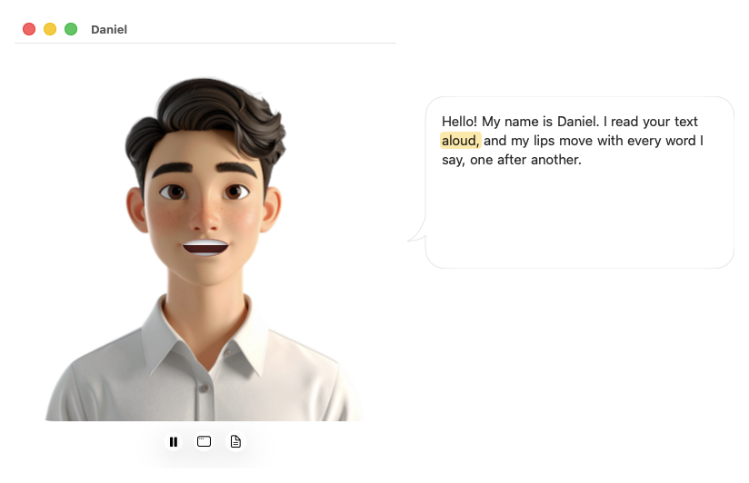
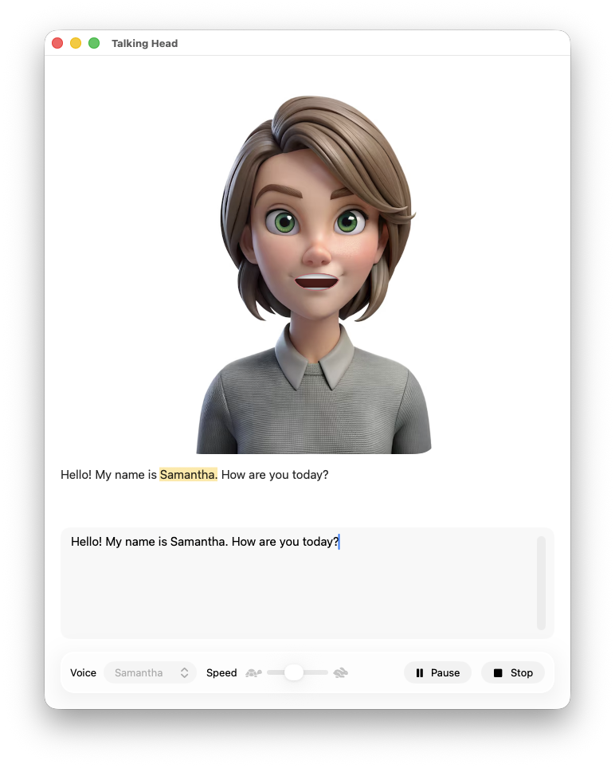

# Talking Head

A macOS menu bar app and `th` command that reads text aloud with Apple's built-in voices while an
animated portrait lip-syncs to it. Anything on your Mac can make it speak: the terminal, other apps,
links, AI agents over MCP, and [VoiceChat](https://github.com/sandipchitale/VoiceChat).

- **Two faces:** a man (Daniel's voice) and a woman (Samantha's), each able to use any installed
  English voice of its gender.
- **Lip sync** to the audio actually playing, with 12 cartoon mouth shapes taken from each word's
  spelling.
- **A lively face:** blinks; eyebrows that lift on stressed words (found from the voice's pitch), on
  capitals, and highest before "?" or "!", and dip on doubtful words ("not", "but", "sorry"…).
- **Moods:** happy, sad, surprised, concerned or angry. Emoji and feeling words suggest the mood of
  each sentence, or a caller sets it: `th --mood concerned "Build failed"`, or `[happy]` cues in the
  text.
- **Listening and thinking:** between speeches, a client such as VoiceChat can have the face listen
  (brows up, a nod per phrase) or think (one brow up, eyes lowered, "···" in the bubble).
- **Speech bubble:** click the head to show the text, with the spoken word highlighted.
- **One queue:** everyone's speech is spoken in turn by one face.

 

https://github.com/user-attachments/assets/fa5e0d48-b055-455c-b689-b5dfc53b3d40



https://github.com/user-attachments/assets/e3388cf4-3ee7-45cc-b270-c060d18efc0e

**Feature tour:** [sandipchitale.github.io/TalkingHead](https://sandipchitale.github.io/TalkingHead/) has
a 🔊 **Explain** link for every feature, which makes Talking Head explain it out loud (with Talking Head
installed). Its source, [`docs/index.html`](docs/index.html), shows how to add such links to your pages.

## Install

Download the latest [release](https://github.com/sandipchitale/TalkingHead/releases), unzip it, and move
`TalkingHead.app` to `/Applications`. It isn't notarized, so clear the quarantine flag once:

```sh
xattr -dr com.apple.quarantine /Applications/TalkingHead.app
ln -sf /Applications/TalkingHead.app/Contents/MacOS/th ~/.local/bin/th   # optional: th on your PATH
open /Applications/TalkingHead.app
```

Turn on **Launch at Login** in its menu to keep it in the menu bar (on macOS Tahoe, also allow it in
System Settings → Menu Bar). Requires macOS 26 (Tahoe) or later.

**⌘Q closes the window, not the app.** With a Talking Head window in front, ⌘Q closes that window
and the applet stays in the menu bar. Quit it from its menu (**Quit Talking Head**).

**Better voices (recommended):** System Settings → Accessibility → **Read & Speak** → ⓘ next to Speak
selection → **English** → **Voice**, and download Daniel and Samantha (Enhanced), or Premium voices such
as Ava or Zoe. Talking Head uses the best installed quality on its own.

## Build

Needs Xcode 26 (Swift 6), and [XcodeGen](https://github.com/yonaskolb/XcodeGen) if you change
`project.yml` (the source of truth for the Xcode project; run `xcodegen generate` and commit both).

```sh
xcodebuild -project TalkingHead.xcodeproj -scheme TalkingHead -configuration Release -derivedDataPath build build
xcodebuild -project TalkingHead.xcodeproj -scheme TalkingHead -derivedDataPath build test
cp -R build/Build/Products/Release/TalkingHead.app /Applications/
```

## Using it

**Menu bar.** Show Talking Head, Type Text to Speak… (⌘⏎ speaks), Play/Pause, Stop, **Voice** (which
face speaks), **Man's Voice** and **Woman's Voice** (the voice each face uses), Speed, Always on Top,
Launch at Login, **MCP Server (port 8766)**, **MCP Server Config…**, and Quit. Choices are remembered.

**Face window.** Titled **Man** or **Woman**, with the voice as subtitle. Click the head for the speech
bubble. Below the head: play/pause (Space; replays the last text when idle), type text, pick a file,
and pin (always on top).

**Command line.**

```
th [-v|--voice male|female] [-m|--mood MOOD] [-t|--tty] [-f|--file path] [-u|--url URL] [--always-on-top] [text ...]
```

| Example | Result |
|---|---|
| `th Build finished` | Speaks the text, then quits |
| `th -f notes.txt` · `echo Hi \| th` · `th -t` | Speaks a file (text, RTF, HTML, Word…), piped input, or what you type (end with Control-D) |
| `th -v female --mood happy …` | The woman's face, looking happy (moods: `neutral`, `happy`, `sad`, `surprised`, `concerned`, `angry`) |
| `th -u 'https://example.com/#:~:text=This%20domain'` | Speaks a web page, or just the passage its text fragment highlights |
| `th -- -5 degrees` | `--` ends the options |
| `th` at a terminal | Just shows the face |

In zsh, quote text containing `?` or `*`, or add `alias th='noglob th'`. Errors print a message and
exit with status 2. When the menu bar app is running, `th` hands its speech to the app's queue and
waits for it to finish; Control-C takes back only its own speech.

**From other apps.**
- **Services menu:** select text anywhere, then right-click → **Services → Speak with Talking Head**. A
  selected web link reads that page.
- **Links:** `talkinghead://speak?text=Hello` or `talkinghead://speak?url=<encoded URL>`, with optional
  `&voice=female` and `&mood=happy`. Try `open "talkinghead://speak?text=Build%20finished"`.
- **Text fragments:** a link from Safari's **Copy Link to Highlight** (`#:~:text=…`) reads just the
  highlighted passage. Pages built by JavaScript may have little text to read.

## MCP server

AI agents can speak with the face through [MCP](https://modelcontextprotocol.io). **MCP Server Config…**
in the menu has ready-to-copy configuration for Claude Code, Codex, Antigravity and `.mcp.json`.

- **stdio:** `claude mcp add talkinghead -- /Applications/TalkingHead.app/Contents/MacOS/th-mcp`. It
  uses the menu bar app when it's running, and `th` otherwise.
- **HTTP:** turn on **MCP Server (port 8766)** (or set `TALKINGHEAD_MCP_HTTP_PORT`), then use
  `http://localhost:8766/mcp`. It listens on `127.0.0.1` only, and is off by default because any local
  account can reach a localhost port. Web apps (claude.ai, chatgpt.com) can't reach it.

| Tool | Arguments | What it does |
|---|---|---|
| `speak` | `text` (may contain `[mood]` cues), `voice`, `mood`, `wait` (default `true`) | Speaks with the face, above other windows |
| `speak_url` | `url` (may end in `#:~:text=…`), `voice`, `mood`, `wait` | Reads a page or its highlighted passage |
| `stop` | none | Stops speaking, drops anything waiting, closes the face |

A call returns when the speech finishes (or starts, with `wait: false`), but never blocks more than 45
seconds (`TALKINGHEAD_MCP_WAIT_MS`); after that it says the speech is still going, and it carries on.
Waiting calls send progress every 5 seconds. Leaving out `voice` uses the menu's face. Errors come back
as plain sentences.

A handy instruction for `CLAUDE.md` or `AGENTS.md`: *"When a task takes more than a minute, announce
the result with the talkinghead speak tool, in one or two sentences, with mood happy if it passed and
concerned if it failed."*

## How it works

- **Speech and timing:** `AVSpeechSynthesizer` renders audio buffers, which the app plays through
  `AVAudioEngine`, so it knows exactly what is audible. While rendering, it records loudness, each
  word's start, and the pitch (autocorrelation every 256 frames), ahead of playback.
- **Mouth:** each word's spelling becomes mouth shapes ("friend" → F, R, EE, N), spread over the time
  the word is voiced; the parametric shape morphs between them.
- **Eyebrows and lids:** narrow columns of the portrait over each brow (or eyelid) are redrawn
  stretched, so no extra artwork is needed. A word is stressed when its pitch rises well above the
  speaker's median, relative to how far that voice usually rises.
- **Moods:** `Script` removes cues and mood emoji and works out the mood at each point: a cue, else
  the mood given for the whole text, else the sentence's guess.
- **One queue (the speech spooler):** the menu bar app speaks everything from one first-in, first-out
  queue, and serves a Unix socket at `~/Library/Application Support/TalkingHead/speech.sock` (0600, in
  a 0700 folder, same user only). The protocol is newline-delimited JSON:
  - `{"type":"speak","text"|"url":…,"voice"?,"mood"?,"alwaysOnTop"?}` → `queued`, `started`, then
    `finished`, `stopped` or `error` `{message}`. Closing the connection takes that speech back.
  - `{"type":"stop"}` → `stopped`: silences everyone's speech.
  - `{"type":"presence","state":"listening"|"thinking"|"none","voice"?,"pulse":"nod"?}` →
    `{"type":"presence"}`: what the face shows between speeches. It's held per connection (the newest
    message wins; `none` or closing drops it), the most recently updated holder is shown, speech
    overrides it, and Stop doesn't clear it. The face opens without taking the keyboard and closes only
    when nothing is queued and nobody holds presence. An older Talking Head answers `error`.
- **`th`** is a script in the app bundle that runs the app with its arguments packed into one
  `-THArguments` value (AppKit would treat bare arguments as documents to open). It first offers its
  speech to the spooler.

## Source layout

| Path | Purpose |
|---|---|
| `TalkingHead/TalkingHeadApp.swift`, `Entry.swift` | App entry, menu, windows; a `th` run handing its speech to the menu bar app |
| `TalkingHead/SpeechEngine.swift`, `AudioPipeline.swift`, `Prosody.swift` | Speech state; synthesis, playback, loudness, pitch and word timing |
| `TalkingHead/Viseme.swift`, `Expression.swift`, `Mood.swift` | Mouth shapes; eyebrow movement and presence poses; moods and `Script` |
| `TalkingHead/FaceView.swift`, `FaceWindow.swift`, `SpeechBubble.swift`, `SpokenTextView.swift` | The portrait, its window and toolbar, and the speech bubble |
| `TalkingHead/InputWindow.swift`, `TextFile.swift`, `WebPage.swift`, `TextFragment.swift` | Typing window, reading files and pages, text fragments |
| `TalkingHead/ExternalRequests.swift` | The Services menu and `talkinghead://` links |
| `TalkingHead/SpeechSpooler.swift` | The one speech queue, the face that speaks it, and its socket server |
| `TalkingHead/MCPHTTPServer.swift`, `MCPServerController.swift`, `MCPConfigWindow.swift` | The HTTP MCP server, its menu item, and the config window |
| `MCPTools/` | Shared by the app and `th-mcp`: tools, turn-taking, the spooler protocol (`Spooler.swift`) and presence rules (`Presence.swift`) |
| `CLI/th`, `CLI/th-mcp/` | The `th` script and the stdio MCP server |
| `TalkingHeadTests/` | Unit tests (Swift Testing) |
| `project.yml` | XcodeGen project definition |

## Adding a portrait

Add the image to `Assets.xcassets` as `<Name>`, generate `<Name>MouthPatch` (skin with the lips painted
out) and `<Name>Eyelids` (skin across the eyes), and add a `Portrait` in `FaceView.swift` with, in image
pixels, the patch and eyelid rectangles, the eyes, each eyebrow's region and lift, the mouth centre and
scale, and a lip colour. Include it in `Portrait.all`.

## Notes

- The app sandbox is off so `th` can read any file you pass.
- The portraits are 360×360 pixels, so they look soft when enlarged on Retina displays.
